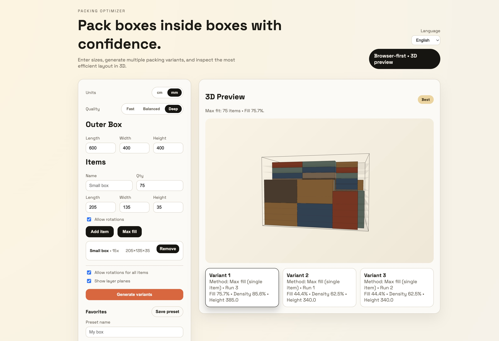

# Boxpack

English | [Русский](README.ru.md)



Live demo: https://yelloduxx.github.io/boxpack/

Boxpack is a browser-based 3D box packing visualizer. Enter outer box and item sizes, generate multiple packing variants, and compare fill efficiency in an interactive 3D view.

## Features
- Multiple packing methods with different strategies (grid, candidate positions, maximal spaces).
- Fast max-fill calculation for identical items.
- Three.js 3D preview with layer planes and orbit controls.
- Favorites and history stored in `localStorage`.
- Unit (cm/mm) and quality (fast/balanced/deep) toggles.
- Multilingual UI.

## Run locally
This is a static project. Use a local server so ES module imports work correctly.

```sh
python3 -m http.server 8080
```

Open `http://localhost:8080` in your browser.

## How to use
1. Set the outer box dimensions.
2. Add items (name, quantity, dimensions, rotation allowed).
3. Click **Generate variants** to compare methods.
4. Pick a variant from the list to view the 3D layout.
5. Use **Max fill** to find the maximum count of identical items.

## Key functions (app.js)
- `t`, `applyTranslations` — i18n lookup and UI text updates.
- `setUnit`, `scaleAllDimensions`, `formatUnitValue` — unit switching and dimension scaling.
- `setQuality`, `getQualityTrialCount` — controls trial counts for fast/deep runs.
- `loadFavorites`/`saveFavorites`, `loadHistory`/`saveHistory` — persist presets and history in `localStorage`.
- `addItem`, `applyDraftItem`, `expandItems` — manage items list and expand by quantity.
- `packItems` — base grid packing algorithm.
- `packItemsCandidates` — candidate-position packing with randomization and tie-breakers.
- `packItemsSpaces` — maximal-space packing with density scoring.
- `packMaxIdenticalItems` — max-fill search for identical items.
- `generateVariants`, `generateMaxFillVariant` — generate and rank variants by fill/compactness.
- `renderVariants`, `renderScene`, `animate` — UI cards and 3D scene rendering.

## Project structure
- `index.html` — markup and Three.js importmap.
- `app.js` — UI logic, packing algorithms, visualization.
- `styles.css` — styles.
- `assets/boxpack-preview.png` — README screenshot.

## Dependencies
- Three.js from CDN: `https://unpkg.com/three@0.161.0/`.

## License
MIT.
